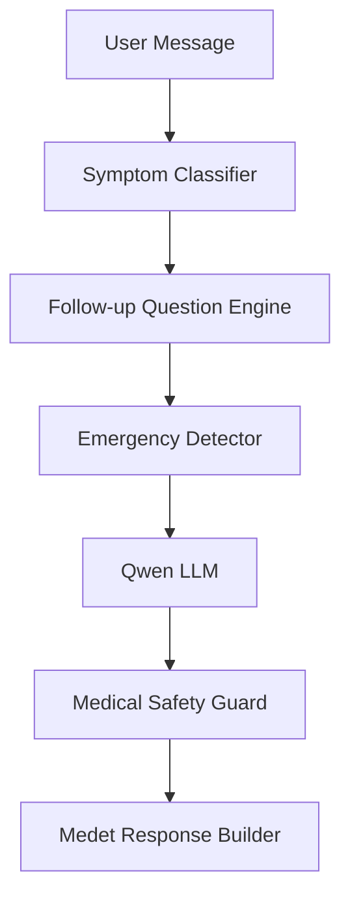

# MEDET Deterministic Triage & Symptom Classification System

This document provides a detailed breakdown of the deterministic symptom classification and follow-up question engine added to the MEDET healthcare chatbot backend.

---

## 1. System Architecture

The new triage flow intercepting the message *before* it is sent to the LLM (Qwen) ensures consistent symptom collection, reduces LLM hallucination/verbosity, and grounds the guide response in clinical guidelines.



---

## 2. Component Details

### A. Symptom Classifier
* **File:** [symptom_classifier.py](file:///Users/nikhilchhetri/medtech/medTech/medet-codex-medet-backend-intelligence/backend/app/services/symptom_classifier.py)
* **Design:** Rule-based matching prioritizing critical demographic groups (like pregnancy) and specific body systems (cardiac, neurological, gastrointestinal, respiratory, injury) over general questions.
* **Return Type:**
  ```python
  @dataclass(frozen=True)
  class SymptomCategory:
      name: str      # e.g., 'cardiac'
      severity: str  # e.g., 'high', 'medium', 'low'
  ```

### B. Follow-up Question Bank
* **File:** [followup_questions.py](file:///Users/nikhilchhetri/medtech/medTech/medet-codex-medet-backend-intelligence/backend/app/services/followup_questions.py)
* **Design:** Provides predefined, clinical symptom-gathering questions to collect duration, severity, and critical warning signs before making choices.
* **Retrieval Method:**
  ```python
  def get_followup_questions(category: str) -> list[str]:
      ...
  ```

### C. LLM Integration
* **File:** [medet.py](file:///Users/nikhilchhetri/medtech/medTech/medet-codex-medet-backend-intelligence/backend/app/routes/medet.py#L204-L224)
* **Integration Point:** `_generate_ai_response(...)`
* **Prompt Injection Format:**
  ```markdown
  Detected symptom category: respiratory
  Severity: low

  Preferred follow-up questions:
  * How many days have you had these symptoms?
  * What is your temperature?
  * Is your cough dry or producing mucus?
  * Are you having trouble breathing?

  Use these questions whenever information is missing.
  ```

---

## 3. Test Cases & Verification

Unit tests are implemented in [test_symptom_classification.py](file:///Users/nikhilchhetri/medtech/medTech/medet-codex-medet-backend-intelligence/tests/test_symptom_classification.py) verifying the rule engine's categorization accuracy:

| Input Text | Expected Category | Expected Severity |
| :--- | :--- | :--- |
| `"I have fever and cough"` | `respiratory` | `low` |
| `"I have chest pain and sweating"` | `cardiac` | `high` |
| `"I am pregnant and have fever"` | `pregnancy` | `medium` |
| `"I have severe headache and blurry vision"` | `neurological` | `medium` |
| `"I have stomach pain and vomiting"` | `gastrointestinal` | `medium` |
| `"I got a deep burn on my arm"` | `injury` | `medium` |
| `"What is the weather today?"` | `general` | `low` |

### How to Run Tests

From the backend root directory, execute:
```bash
.venv/bin/pytest tests/test_symptom_classification.py -v
```
