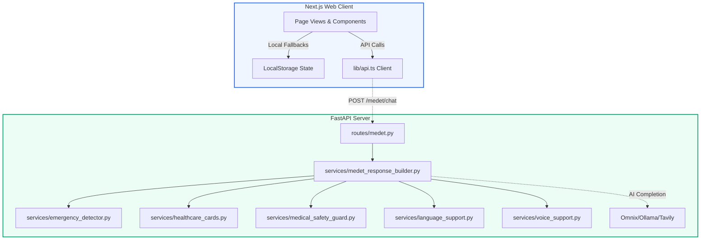

# MEDET — Codebase Review & Integration Analysis

We have completed a comprehensive file-by-file review of the **MEDET** AI-Powered Rural Healthcare Assistant project across both active workspaces. Below is a detailed breakdown of the codebase architecture, its strengths, identified gaps, and structural alignment issues.

---

## 📂 System Architecture Overview

The system is split into two distinct, lightweight components:
1. **Next.js 16 (React 19) Frontend**: Mobile-first, low-bandwidth optimized, supporting multi-language settings and accessibility standards (located at `/Users/nikhilchhetri/Downloads/medet-codex-medet-frontend-intelligence`).
2. **FastAPI (Python) Backend**: A stateless safety guard, multilingual instruction context builder, and rule-based emergency classifier (located at `/Users/nikhilchhetri/medtech/medet`).



---

## 🛠️ Feature Matrix: Specification vs. Implementation

Here is how the current implementation matches the goals set forth in the [frontend.md](file:///Users/nikhilchhetri/Downloads/medet-codex-medet-frontend-intelligence/frontend.md) specification:

| Feature / Screen | Spec Requirement | Frontend State | Backend State | Alignment & Wiring Status |
| :--- | :--- | :--- | :--- | :--- |
| **1. Landing Page** | Compelling CTAs, emergency banner, clean illustration mockups. | ✅ Complete ([page.tsx](file:///Users/nikhilchhetri/Downloads/medet-codex-medet-frontend-intelligence/app/page.tsx)) | *N/A (Static)* | Ready. |
| **2. Login / Signup** | Phone OTP, Google, guest entry flows. | ✅ Complete UI ([login/page.tsx](file:///Users/nikhilchhetri/Downloads/medet-codex-medet-frontend-intelligence/app/login/page.tsx)) | ❌ Missing APIs | Fully mocked in API layer. Falls back to local Session state. |
| **3. AI Chat** | Mobile-first chat, streaming responses, cards. | ⚠️ UI Only ([chat/page.tsx](file:///Users/nikhilchhetri/Downloads/medet-codex-medet-frontend-intelligence/app/chat/page.tsx)) | ✅ Complete endpoints | **Disconnected**. The chat page uses a local mock function rather than `streamChatMessage` from `lib/api.ts`. |
| **4. Emergency Panel** | Warning signs, contacts list, nearby hospitals list. | ✅ Complete UI ([emergency/page.tsx](file:///Users/nikhilchhetri/Downloads/medet-codex-medet-frontend-intelligence/app/emergency/page.tsx)) | ✅ Keyword Classifier | Ready. |
| **5. Nearby Help** | Location lookup, clinics map cards, phone numbers. | ✅ Complete UI ([nearby/page.tsx](file:///Users/nikhilchhetri/Downloads/medet-codex-medet-frontend-intelligence/app/nearby/page.tsx)) | ❌ Missing APIs | Hardcoded seed data fallback. Needs API wiring or browser geolocation mapping. |
| **6. Reminders** | Elderly-friendly schedule list, add forms, check statuses. | ✅ Complete UI ([reminders/page.tsx](file:///Users/nikhilchhetri/Downloads/medet-codex-medet-frontend-intelligence/app/reminders/page.tsx)) | ❌ Missing APIs | Local storage fallback only. |
| **7. Language Selection** | Fast native-language setup (7 languages). | ✅ Complete UI ([language/page.tsx](file:///Users/nikhilchhetri/Downloads/medet-codex-medet-frontend-intelligence/app/language/page.tsx)) | ⚠️ Partially Complete | Backend supports 6 of the 7 languages (missing Marathi `mr`). |
| **8. Voice Mode** | Large touch mic, transcript feedback, auto voice replies. | ⚠️ Mocked UI ([voice/page.tsx](file:///Users/nikhilchhetri/Downloads/medet-codex-medet-frontend-intelligence/app/voice/page.tsx)) | ❌ Missing TTS/STT APIs | Using sample hardcoded text indices. TTS and STT are mocked in the API layer. |
| **9. Profile System** | Quick member details, condition lists, allergens. | ✅ Complete UI ([profile/page.tsx](file:///Users/nikhilchhetri/Downloads/medet-codex-medet-frontend-intelligence/app/profile/page.tsx)) | ❌ Missing APIs | Fully fallback based. |

---

## ⚡ Integration Gaps & Critical Findings

We found several blockers and disconnects that need to be resolved to make the project function as a unified experience:

### 1. API Endpoint Path Mismatches
* **Issue**: The frontend [`lib/api.ts`](file:///Users/nikhilchhetri/Downloads/medet-codex-medet-frontend-intelligence/lib/api.ts#L291) calls standard paths like `${API_BASE_URL}/chat/stream`, `${API_BASE_URL}/profiles`, `${API_BASE_URL}/reminders`, etc.
* **Backend Prefix**: The backend router in [`backend/app/routes/medet.py`](file:///Users/nikhilchhetri/medtech/medet/backend/app/routes/medet.py#L24) attaches with a prefix of `/medet`:
  ```python
  router = APIRouter(prefix="/medet", tags=["medet"])
  ```
  Thus, the backend expects `/medet/chat` and `/medet/chat/stream`. Calling `/chat/stream` will lead to `404 Not Found`.

### 2. Chat UI Local Mocking
* **Issue**: The chat client in [`app/chat/page.tsx`](file:///Users/nikhilchhetri/Downloads/medet-codex-medet-frontend-intelligence/app/chat/page.tsx#L41-L60) handles replies via a local helper `buildAssistantReply` instead of calling `streamChatMessage(...)` or using SSE chunks. It also runs a separate basic regular expression for emergency validation, bypassing the backend's highly robust safety and rule-based detectors.

### 3. Missing Language: Marathi (`mr`)
* **Issue**: The frontend fully supports Marathi (`mr`), with translation JSONs and options. However, the backend schemas and services do not. 
* **Backend Blockers**: 
  * [`backend/app/schemas/medet_response.py`](file:///Users/nikhilchhetri/medtech/medet/backend/app/schemas/medet_response.py#L9) enforces validation: `SUPPORTED_LANGUAGES = {"en", "hi", "bn", "ne", "ta", "kn"}` (excluding `mr`). Any request with `language="mr"` throws a `422 Unprocessable Entity` validation error.
  * [`backend/app/services/language_support.py`](file:///Users/nikhilchhetri/medtech/medet/backend/app/services/language_support.py) lacks Marathi definitions for `LANGUAGE_PROFILES`, `FOLLOWUP_TEXT`, and `EMERGENCY_ESCALATION_TEXT`.
  * [`backend/app/services/emergency_detector.py`](file:///Users/nikhilchhetri/medtech/medet/backend/app/services/emergency_detector.py) lacks Marathi emergency keyword lists.

### 4. Voice Interaction UI is Static
* **Issue**: The page [`app/voice/page.tsx`](file:///Users/nikhilchhetri/Downloads/medet-codex-medet-frontend-intelligence/app/voice/page.tsx) uses a hardcoded array of `transcriptSamples` mapped to index buttons, and toggles static "listening" states without recording audio or making web requests to STT or TTS services.

### 5. Stateless Backend (No Reminders, Auth, or Profiles)
* **Issue**: The backend only has routes for chat. The database/persistence for profiles, auth, and medicine reminders is entirely handled by LocalStorage fallback code inside `lib/api.ts`.

---

## 🎯 Proposed Solutions & Next Steps

To prepare this project for a robust demonstration and make it fully functional, we can execute the following steps:

1. **Fix API Path Routing**: Change the frontend client calls in [`lib/api.ts`](file:///Users/nikhilchhetri/Downloads/medet-codex-medet-frontend-intelligence/lib/api.ts) to prepend the `/medet` path prefix (or configure a rewrite rule).
2. **Wire the Chat UI to the Streaming Backend**: Update [`app/chat/page.tsx`](file:///Users/nikhilchhetri/Downloads/medet-codex-medet-frontend-intelligence/app/chat/page.tsx) to consume `streamChatMessage` chunk-by-chunk and dynamically render the emergency cards returned in the final metadata event.
3. **Implement Backend Marathi Support**: Add `mr` to the backend language validator, create language profiles, and write emergency classification rules in Marathi.
4. **Make Voice UI Interactive**: Integrate actual browser-native `SpeechRecognition` (for STT) and `speechSynthesis` (using the existing `speakWithBrowser` helper) in the voice page.
5. **Set up Running Environments**: Run the backend FastAPI server and Next.js frontend concurrently to test real end-to-end routing.
