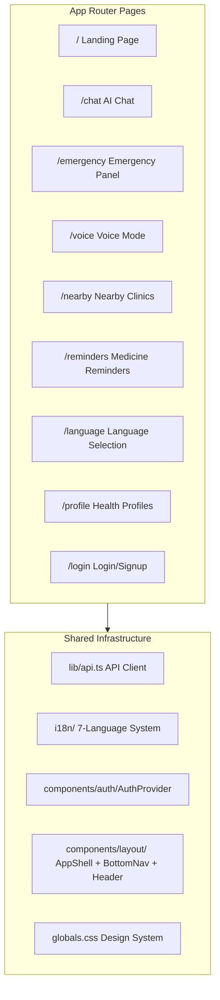
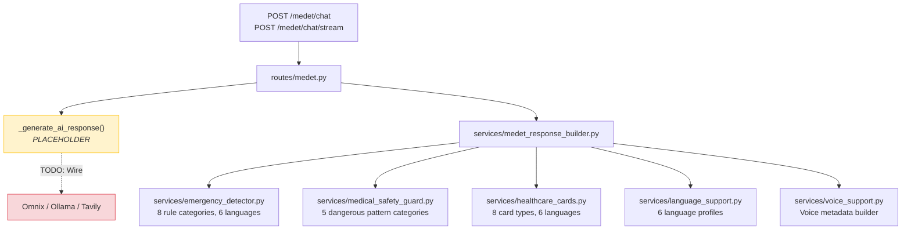

# MEDET — Complete Codebase Deep Dive

> Two repositories, one product: an AI-powered rural healthcare assistant designed for underserved communities.

---

## 1. Repository Map

| Repo | Location | Stack | Purpose |
|------|----------|-------|---------|
| **Frontend** | `/Users/nikhilchhetri/Downloads/medet-codex-medet-frontend-intelligence` | Next.js 16, React 19, TailwindCSS 4, Framer Motion, shadcn | Mobile-first healthcare UI |
| **Backend** | `/Users/nikhilchhetri/medtech/medet` | FastAPI (Python), Pydantic v2 | Safety guard, emergency detection, response building |

---

## 2. What MEDET Is

MEDET is a **compassionate AI healthcare companion** for rural and underserved communities. It is NOT a chatbot — it's positioned as an intelligent healthcare assistant that:

- Asks follow-up symptom questions (never diagnoses)
- Detects medical emergencies via multilingual keyword matching
- Sanitizes AI responses (strips dangerous medication advice, guaranteed diagnoses, etc.)
- Generates contextual healthcare cards (emergency, hydration, nutrition, follow-up, etc.)
- Supports **7 Indian languages**: English, Hindi, Bengali, Nepali, Tamil, Kannada, Marathi
- Provides voice-first interaction for low-literacy users
- Shows nearby clinics, medicine reminders, and family health profiles

---

## 3. Frontend Architecture (Next.js 16 / React 19)



### 3.1 Pages — File by File

#### [page.tsx](file:///Users/nikhilchhetri/Downloads/medet-codex-medet-frontend-intelligence/app/page.tsx) — Landing Page ✅ Complete
- Hero section with compassionate messaging, animated badge
- 6 feature cards (Chat, Voice, Emergency, Reminders, Nearby, Multilingual) — all linked
- Trust section with chat preview mockup
- Emergency banner with call-to-action
- Footer with branding
- Uses `framer-motion` stagger animations, `lucide-react` icons
- i18n integrated via `useLanguage()` hook
- **Status**: Production-ready static page

#### [chat/page.tsx](file:///Users/nikhilchhetri/Downloads/medet-codex-medet-frontend-intelligence/app/chat/page.tsx) — AI Chat ⚠️ **Disconnected from Backend**
- Clean mobile-first chat UI with bubble messages
- Quick action buttons (Symptom Check, Medicine Info, First Aid, Nutrition)
- Emergency message styling with red cards + call/hospital links
- Language panel sidebar + "How MEDET guides you" info card
- Voice input toggle (UI only, not wired to `SpeechRecognition`)
- **Critical Issue**: Uses local [`buildAssistantReply()`](file:///Users/nikhilchhetri/Downloads/medet-codex-medet-frontend-intelligence/app/chat/page.tsx#L41-L60) instead of calling [`streamChatMessage()`](file:///Users/nikhilchhetri/Downloads/medet-codex-medet-frontend-intelligence/lib/api.ts#L285-L319) from `lib/api.ts`
- The local function uses a basic regex (`chest pain|breathing|stroke...`) vs. the backend's robust multilingual emergency detector

#### [emergency/page.tsx](file:///Users/nikhilchhetri/Downloads/medet-codex-medet-frontend-intelligence/app/emergency/page.tsx) — Emergency Panel ✅ Complete
- Warning signs list, emergency contacts section
- Nearest hospitals display
- Call 112 prominent CTA
- Well-styled emergency card layout

#### [voice/page.tsx](file:///Users/nikhilchhetri/Downloads/medet-codex-medet-frontend-intelligence/app/voice/page.tsx) — Voice Mode ⚠️ **Static/Mocked**
- Large tap-to-speak mic button with ping animation
- Transcript display panel
- Emergency detection on transcript text
- Play/pause voice reply toggle
- "Send to chat" action
- **Critical Issue**: Uses 3 hardcoded `transcriptSamples` with index-switching buttons — no actual `SpeechRecognition` API or audio recording
- The [`speakWithBrowser()`](file:///Users/nikhilchhetri/Downloads/medet-codex-medet-frontend-intelligence/lib/api.ts#L520-L539) helper exists in `api.ts` but is never called

#### [nearby/page.tsx](file:///Users/nikhilchhetri/Downloads/medet-codex-medet-frontend-intelligence/app/nearby/page.tsx) — Nearby Clinics ✅ Complete UI
- Clinic cards with type, distance, travel time, phone
- Open/closed status indicators
- Geolocation request support (calls `getBrowserLocation()`)
- **Data Source**: Falls back to 4 hardcoded seed clinics; no real API

#### [reminders/page.tsx](file:///Users/nikhilchhetri/Downloads/medet-codex-medet-frontend-intelligence/app/reminders/page.tsx) — Medicine Reminders ✅ Complete UI
- Reminder cards with medicine name, dosage, time, period
- Status toggles (pending/taken/missed)
- Add reminder form
- **Data Source**: LocalStorage only, no backend endpoint

#### [language/page.tsx](file:///Users/nikhilchhetri/Downloads/medet-codex-medet-frontend-intelligence/app/language/page.tsx) — Language Selection ✅ Complete
- 7-language grid with native script names
- Instant switching via `useLanguage()` context
- Persisted to localStorage

#### [profile/page.tsx](file:///Users/nikhilchhetri/Downloads/medet-codex-medet-frontend-intelligence/app/profile/page.tsx) — Health Profiles ✅ Complete UI
- Family member cards with name, age, blood group, allergies, conditions, medicines
- Emergency contacts per member
- **Data Source**: LocalStorage with 2 seed profiles, no backend endpoint

#### [login/page.tsx](file:///Users/nikhilchhetri/Downloads/medet-codex-medet-frontend-intelligence/app/login/page.tsx) — Login/Signup ✅ Complete UI
- Phone OTP flow, Google sign-in, Guest access
- **Data Source**: All auth is fully mocked via local session creation in `api.ts`

---

### 3.2 Shared Infrastructure

#### [lib/api.ts](file:///Users/nikhilchhetri/Downloads/medet-codex-medet-frontend-intelligence/lib/api.ts) — API Client Layer (620 lines)
This is the **central integration layer** between frontend and backend. It includes:

| Function | Purpose | Status |
|----------|---------|--------|
| `streamChatMessage()` | SSE streaming chat to backend `/chat/stream` | ✅ Written, ❌ Not called by chat page |
| `signInWithPhone()`, `signInWithGoogle()`, `continueAsGuest()` | Auth flows | Mocked (local fallback) |
| `getHealthProfiles()`, `saveHealthProfile()` | Profile CRUD | LocalStorage fallback |
| `getReminders()`, `saveReminder()` | Reminder CRUD | LocalStorage fallback |
| `transcribeAudio()` | STT via `/voice/stt` | Endpoint doesn't exist |
| `synthesizeSpeech()` | TTS via `/voice/tts` | Endpoint doesn't exist |
| `speakWithBrowser()` | Browser-native `speechSynthesis` | ✅ Written, ❌ Not used |
| `getNearbyClinics()` | Clinic lookup via `/clinics?lat=...&lng=...` | Seed data fallback |
| `getBrowserLocation()` | Browser geolocation API | ✅ Works |
| `isEmergencyText()` | Basic English-only regex | ✅ Works (limited) |

> [!WARNING]
> **API path mismatch**: The frontend calls `${API_BASE_URL}/chat/stream` but the backend expects `${API_BASE_URL}/medet/chat/stream` (router prefix is `/medet`).

#### [i18n/](file:///Users/nikhilchhetri/Downloads/medet-codex-medet-frontend-intelligence/i18n) — Internationalization System
- 7 translation JSON files (~5-8KB each) covering all UI strings
- `LanguageProvider` context with `useSyncExternalStore` for instant reactivity
- Dot-notation key lookup with English fallback
- Language persisted to localStorage

#### [globals.css](file:///Users/nikhilchhetri/Downloads/medet-codex-medet-frontend-intelligence/app/globals.css) — Design System (355 lines)
- Full MEDET color palette (Primary Blue, Secondary Green, Emergency Red, Warm Amber, AI Purple)
- Light + Dark mode variables
- Custom utility classes: gradients, glassmorphism, shadows, animations
- Accessibility: 44px minimum tap targets, focus-visible styles
- Emergency-specific styles (pulsing border, left-accent cards)

#### [components/layout/](file:///Users/nikhilchhetri/Downloads/medet-codex-medet-frontend-intelligence/components/layout)
- `AppShell.tsx` — Page wrapper
- `Header.tsx` — Top navigation bar
- `BottomNav.tsx` — Mobile bottom navigation (Chat, Voice, Emergency, Profile)
- `PageTransition.tsx` — Framer Motion page transitions

---

## 4. Backend Architecture (FastAPI / Python)



### 4.1 Routes — [medet.py](file:///Users/nikhilchhetri/medtech/medet/backend/app/routes/medet.py)

Two endpoints:
- **`POST /medet/chat`** — Non-streaming JSON response
- **`POST /medet/chat/stream`** — SSE streaming with `token` events + final `metadata` event

Both accept [`MedetChatRequest`](file:///Users/nikhilchhetri/medtech/medet/backend/app/schemas/medet_response.py#L74-L79):
```json
{
  "message": "I have chest pain",
  "input_type": "text",      // or "voice"
  "language": "en",           // en|hi|bn|ne|ta|kn (NOT mr!)
  "conversation_id": "optional-uuid",
  "stream": false
}
```

> [!IMPORTANT]
> The AI generation function [`_generate_ai_response()`](file:///Users/nikhilchhetri/medtech/medet/backend/app/routes/medet.py#L180-L202) is a **placeholder**. It returns a static follow-up question text and empty sources. The comment says: *"Replace with existing Omnix/Ollama/Tavily service call."*

### 4.2 Response Builder — [medet_response_builder.py](file:///Users/nikhilchhetri/medtech/medet/backend/app/services/medet_response_builder.py)
The orchestration layer that assembles the final `MedetResponse`:
1. Runs emergency detection on **both** user message AND AI answer
2. Passes through medical safety guard
3. Builds healthcare UI cards
4. Attaches voice metadata if `input_type == "voice"`
5. Returns structured JSON with `emergency`, `severity`, `cards`, `medical_warning`, `trust_level`, etc.

### 4.3 Emergency Detector — [emergency_detector.py](file:///Users/nikhilchhetri/medtech/medet/backend/app/services/emergency_detector.py) (378 lines)
Rule-based system with **8 emergency categories**:

| Category | Severity | Multilingual Support |
|----------|----------|---------------------|
| Chest pain / heart attack | High | en, hi (transliterated + Devanagari), ne, bn, ta, kn |
| Breathing difficulty | High | Same 6 languages |
| Severe bleeding | High | Same 6 languages |
| Unconsciousness | High | Same 6 languages |
| Seizure | High | Same 6 languages |
| Stroke symptoms | High | Same 6 languages |
| Pregnancy bleeding | High | Same 6 languages |
| Severe burns | High | Same 6 languages |

- Each rule has keyword lists AND compiled regex patterns
- Negation detection: *"no chest pain"* or *"chest pain stopped"* won't trigger
- Text normalization preserves Devanagari, Bengali, Tamil, Kannada Unicode

### 4.4 Medical Safety Guard — [medical_safety_guard.py](file:///Users/nikhilchhetri/medtech/medet/backend/app/services/medical_safety_guard.py) (237 lines)
Post-processes AI output to catch **5 categories of dangerous content**:

| Rule | What it Catches | Action |
|------|----------------|--------|
| `guaranteed_diagnosis` | "You definitely have malaria" | Removes sentence |
| `unsafe_medication_certainty` | "Take 500mg antibiotic" | Removes sentence |
| `dangerous_self_treatment` | "No need to see a doctor" | Removes sentence |
| `emergency_minimization` | "Chest pain is nothing to worry about" | Removes sentence |
| `fake_medical_confidence` | "Guaranteed cure", "No side effects" | Removes sentence |

After stripping, it appends localized fallback text + doctor suggestion text + uncertainty disclaimer.

### 4.5 Healthcare Cards — [healthcare_cards.py](file:///Users/nikhilchhetri/medtech/medet/backend/app/services/healthcare_cards.py) (143 lines)
Generates up to 5 UI cards based on context:

| Card Type | When Generated |
|-----------|---------------|
| `emergency` | Emergency detected |
| `action` | Always |
| `hydration` | Fever, vomiting, diarrhea, dehydration keywords |
| `medication` | Medicine-related keywords or medical warning |
| `doctor_visit` | Emergency, suggest_doctor flag, or medium/high severity |
| `symptom_warning` | Worsening symptoms or medical warning |
| `nutrition` | Weakness, food, pregnancy keywords |
| `followup` | Always (non-emergency) |

All card titles and content are available in **6 languages** (en, hi, bn, ne, ta, kn).

### 4.6 Language Support — [language_support.py](file:///Users/nikhilchhetri/medtech/medet/backend/app/services/language_support.py) (190 lines)
- 6 language profiles with display names, native names, speech locales, prompt hints
- Multilingual system instruction builder for AI prompts
- Follow-up text, emergency escalation text, doctor suggestion text in all 6 languages

### 4.7 Schemas — [medet_response.py](file:///Users/nikhilchhetri/medtech/medet/backend/app/schemas/medet_response.py) (147 lines)
Pydantic v2 models with validators:
- `MedetChatRequest` — validates message (1-4000 chars), input_type, language
- `MedetResponse` — full response with cards, sources, voice metadata
- `MedetCard`, `MedetSource`, `MedetVoiceMetadata` — nested models
- `SUPPORTED_LANGUAGES = {"en", "hi", "bn", "ne", "ta", "kn"}` — **Missing `mr` (Marathi)**

### 4.8 Tests (6 test files, ~100 test cases)

| Test File | Coverage |
|-----------|----------|
| [test_medet_api_contract.py](file:///Users/nikhilchhetri/medtech/medet/tests/test_medet_api_contract.py) | Full API contract: chat, streaming, validation errors, sources, safety guard |
| [test_emergency_detector.py](file:///Users/nikhilchhetri/medtech/medet/tests/test_emergency_detector.py) | Emergency detection rules |
| [test_healthcare_cards.py](file:///Users/nikhilchhetri/medtech/medet/tests/test_healthcare_cards.py) | Card generation logic |
| [test_medet_response_builder.py](file:///Users/nikhilchhetri/medtech/medet/tests/test_medet_response_builder.py) | Response assembly pipeline |
| [test_medical_safety_guard.py](file:///Users/nikhilchhetri/medtech/medet/tests/test_medical_safety_guard.py) | Dangerous content filtering |
| [test_language_support.py](file:///Users/nikhilchhetri/medtech/medet/tests/test_language_support.py) | Language profile and prompt building |

---

## 5. Integration Gaps — What's Broken / Missing

### 🔴 Critical (Blocks core functionality)

| # | Issue | Location | Impact |
|---|-------|----------|--------|
| 1 | **Chat page uses local mock, not backend API** | [chat/page.tsx:41-60](file:///Users/nikhilchhetri/Downloads/medet-codex-medet-frontend-intelligence/app/chat/page.tsx#L41-L60) | Chat responses are fake — no AI, no safety guard, no emergency detection, no cards |
| 2 | **API path mismatch** (`/chat/stream` vs `/medet/chat/stream`) | [api.ts:291](file:///Users/nikhilchhetri/Downloads/medet-codex-medet-frontend-intelligence/lib/api.ts#L291) | Even if wired, calls will 404 |
| 3 | **Backend AI generation is a placeholder** | [medet.py:180-202](file:///Users/nikhilchhetri/medtech/medet/backend/app/routes/medet.py#L180-L202) | Backend always returns static follow-up text; no Omnix/Ollama/Tavily integration yet |

### 🟡 Important (Limits demo quality)

| # | Issue | Location | Impact |
|---|-------|----------|--------|
| 4 | **Voice UI is completely static** | [voice/page.tsx:22-26](file:///Users/nikhilchhetri/Downloads/medet-codex-medet-frontend-intelligence/app/voice/page.tsx#L22-L26) | No actual speech recognition or synthesis; hardcoded samples only |
| 5 | **Marathi (`mr`) missing from backend** | [medet_response.py:9](file:///Users/nikhilchhetri/medtech/medet/backend/app/schemas/medet_response.py#L9) | Frontend supports 7 languages, backend rejects Marathi with 422 error |
| 6 | **No backend for Auth, Profiles, Reminders, Clinics** | [api.ts:377-611](file:///Users/nikhilchhetri/Downloads/medet-codex-medet-frontend-intelligence/lib/api.ts#L377-L611) | All these features run on localStorage fallbacks only |

### 🟢 Minor / Polish

| # | Issue | Location | Impact |
|---|-------|----------|--------|
| 7 | **Hardcoded English strings in some components** | Various pages | Some text isn't going through `t()` translation function |
| 8 | **No loading/streaming skeleton in chat** | chat/page.tsx | Messages appear instantly instead of streaming word-by-word |
| 9 | **Backend cards not rendered in frontend** | chat/page.tsx | The backend returns rich cards (`emergency`, `hydration`, etc.) but the chat UI doesn't display them |

---

## 6. What Needs To Be Done (Prioritized)

### Phase 1 — Make It Work (Core Wiring)

1. **Fix API path prefix**: Either add `/medet` prefix to all frontend API calls, or configure a Next.js rewrite rule to proxy `/api/*` → `backend:8000/medet/*`

2. **Wire chat page to `streamChatMessage()`**: Replace `buildAssistantReply()` with actual streaming, rendering tokens incrementally, and displaying backend-generated cards

3. **Connect a real LLM to the backend**: Replace `_generate_ai_response()` placeholder with Omnix/Ollama/Tavily call. The `build_multilingual_prompt_context()` function already generates proper system prompts

4. **Add Marathi to backend**: Add `"mr"` to `SUPPORTED_LANGUAGES`, create language profile, follow-up/escalation/doctor texts, and emergency keywords in Marathi

### Phase 2 — Make It Real (Feature Completion)

5. **Wire Voice UI to browser `SpeechRecognition`**: Replace hardcoded samples with actual `webkitSpeechRecognition` API; use the existing `speakWithBrowser()` for TTS

6. **Render backend healthcare cards**: Parse the `cards` array from the streaming metadata event and display Emergency, Hydration, Medication, Follow-up cards in the chat

7. **Both servers running**: Set up concurrent dev environment — FastAPI on port 8000, Next.js on port 3000, with proper CORS configuration

### Phase 3 — Make It Shine (Demo Polish)

8. **Replace hardcoded English strings** with `t()` calls throughout all pages

9. **Add streaming skeleton animation** to chat while AI responds

10. **Add Supabase or similar for Auth/Profiles/Reminders** (currently all localStorage)

---

## 7. Code Quality Observations

### Strengths ✅
- **Extremely well-structured backend**: Clean separation of concerns (detector → guard → cards → builder), transparent rule-based safety instead of ML black boxes
- **Comprehensive test suite**: 6 test files covering API contract, safety, emergency detection, and card generation
- **Thoughtful i18n**: Full 7-language translation system with fallbacks
- **Polished design system**: Custom CSS variables, healthcare-appropriate color palette, dark mode, accessibility (tap targets, focus styles)
- **Robust API client**: `lib/api.ts` has proper error handling, localStorage fallbacks, and type-safe interfaces — it just needs to be called

### Concerns ⚠️
- Frontend and backend were clearly built in parallel without integration testing
- The `_generate_ai_response()` placeholder means the backend has never produced a real AI response
- No CORS middleware configured in `main.py` (will block cross-origin requests when both servers run)
- No `requirements.txt` or `pyproject.toml` visible in the backend repo for dependency management
