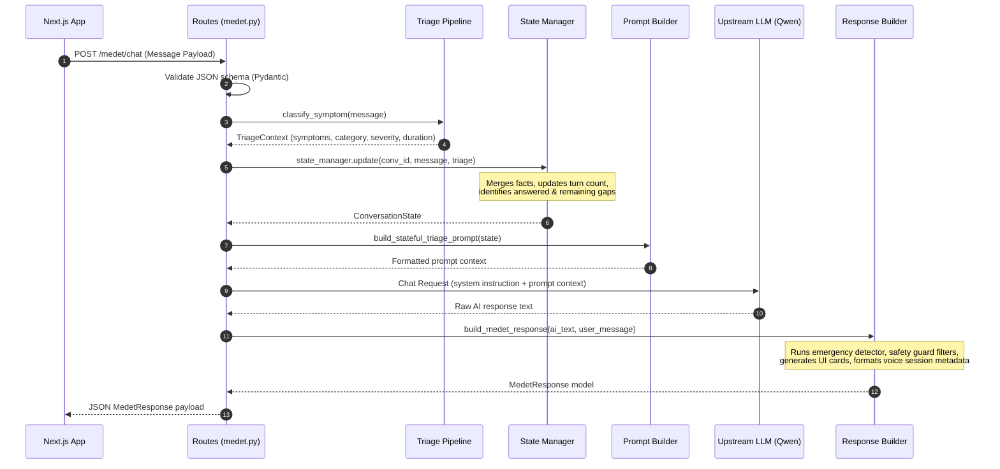

# Medet Backend Architecture & Codebase Analysis

**MEDET** is a specialized, compassionate AI-powered rural healthcare assistant designed for underserved and rural communities. Unlike general chatbots, MEDET prioritizes clinical safety, accessibility, local language support, deterministic emergency detection, and structured context-aware conversations.

The backend is built as a lightweight **FastAPI** service that serves as a safety filter, context orchestrator, and structured metadata provider for the user-facing client.

---

## 1. Directory Structure

```
backend/
├── __init__.py
└── app/
    ├── __init__.py
    ├── main.py                    # Entrypoint & Exception handlers
    ├── core/
    │   ├── __init__.py
    │   └── errors.py              # Custom error declarations
    ├── routes/
    │   ├── __init__.py
    │   └── medet.py               # Chat and Streaming API controllers
    ├── schemas/
    │   ├── __init__.py
    │   └── medet_response.py      # Input/Output Pydantic structures
    └── services/
        ├── __init__.py
        ├── symptom_patterns.py    # [NEW] Category-specific symptom keywords
        ├── symptom_extractor.py   # [NEW] Scans text and extracts symptoms/confidence
        ├── severity_detector.py   # [NEW] Rule-based severity level classifier
        ├── duration_detector.py   # [NEW] Regex-based temporal expression extractor
        ├── missing_info_detector.py # [NEW] Identifies missing clinical detail gaps
        ├── followup_questions.py  # Prioritized & category-specific follow-up questions
        ├── conversation_state.py  # [NEW] Multi-turn patient state manager & facts store
        ├── conversation_state_rules.py # [NEW] Decision logic stubs for stages & prioritization
        ├── symptom_classifier.py  # Triage pipeline orchestrator
        ├── emergency_detector.py  # Regex & keyword-based emergency warning detector
        ├── healthcare_cards.py    # Actions/warning card builder
        ├── language_support.py    # Localized strings, prompts, translations
        ├── medet_response_builder.py # Main response validation & contract orchestrator
        ├── medical_safety_guard.py# Output clinical safety filter
        ├── triage_prompt_builder.py # [NEW] Converts TriageContext/State to LLM prompts
        └── voice_support.py       # Speech/audio metadata builder
```

---

## 2. Component Breakdown

### 🔌 App Entrypoint & Exception Handling
* **File:** [main.py](file:///Users/nikhilchhetri/medtech/medTech/medet-codex-medet-backend-intelligence/backend/app/main.py)
* **Description:** Initializes the FastAPI app, registers the `/medet` router, and provides safety-net exception handlers.
* **Key Mechanisms:**
  * Maps standard FastAPI `RequestValidationError` errors (422) into user-friendly JSON payloads conforming to `MedetErrorResponse`.
  * Catches empty queries, malformed JSON, and invalid languages, returning safe, parseable errors instead of raw stack traces.
  * Catches `MedetAPIError` (e.g., LLM upstream timeouts or connection failures) and reports retry options.

---

### 🌐 Routing & Endpoints
* **File:** [medet.py](file:///Users/nikhilchhetri/medtech/medTech/medet-codex-medet-backend-intelligence/backend/app/routes/medet.py)
* **Description:** Exposes routes for chat interaction.
* **Key Endpoints:**
  1. `POST /medet/chat`: Receives `MedetChatRequest` and returns a non-streaming structured `MedetResponse`.
  2. `POST /medet/chat/stream`: Server-Sent Events (SSE) streaming API. Emits raw tokens with `event: token` as they stream from the LLM, followed by a final `event: metadata` event containing the structured `MedetResponse` metadata payload (including emergency flags, safety warnings, and actionable cards) and `event: error` if anything goes wrong.
* **State Integration:** Feeds raw messages into the symptom classification pipeline, updates the multi-turn state manager, and uses the stateful prompt builder before invoking the LLM.

---

### 📋 Data Validation & Schemas
* **File:** [medet_response.py](file:///Users/nikhilchhetri/medtech/medTech/medet-codex-medet-backend-intelligence/backend/app/schemas/medet_response.py)
* **Description:** Defines validation schemas for inputs and outputs.
* **Key Structs:**
  * `MedetChatRequest`: Validates message length (1-4000), checks input type (`text` or `voice`), and verifies supported languages (`en`, `hi`, `bn`, `ne`, `ta`, `kn`).
  * `MedetResponse`: The structured response payload returning the sanitized response text, emergency indicators, clinical severity evaluations, safety warnings, actionable healthcare cards, and voice metadata.

---

### 🩺 Symptom Triage Pipeline
Coordinates the analysis of the patient's description across distinct modular stages:

1. **Symptom Patterns (`symptom_patterns.py`)**: Stores raw keyword dictionaries representing 7 clinical categories: `respiratory`, `cardiac`, `neurological`, `gastrointestinal`, `pregnancy`, `injury`, and `general`, alongside emergency indicators.
2. **Symptom Extraction (`symptom_extractor.py`)**: Identifies all matching keywords in the message. Resolves the clinical category (with `pregnancy` taking highest priority). Computes a confidence score based on the specific symptom counts.
3. **Severity Detection (`severity_detector.py`)**: Labels severity as `high`, `medium`, or `low` based on intensity descriptors (e.g., "severe", "unbearable" vs. "persistent", "getting worse").
4. **Duration Detection (`duration_detector.py`)**: Parses temporal expressions (e.g., "3 days", "since yesterday", "one week") using regex, normalizing word-based numbers to digits.
5. **Missing Info Detection (`missing_info_detector.py`)**: Flags information gaps that the user did not specify (e.g., missing duration, low-severity default on a distinct category, or fever without temperature).
6. **Orchestrator (`symptom_classifier.py`)**: Runs the pipeline sequentially and returns a structured `TriageContext` containing the category, symptoms, severity, duration, and missing information gaps.

---

### 🧠 Conversation State Engine
Tracks the context and collected facts over multiple turn cycles to ensure the AI never re-asks questions already answered.

* **File:** [conversation_state.py](file:///Users/nikhilchhetri/medtech/medTech/medet-codex-medet-backend-intelligence/backend/app/services/conversation_state.py)
* **`PatientFact`**: Stores a collected value with associated confidence and source:
  ```python
  @dataclass(frozen=True)
  class PatientFact:
      value: Any
      confidence: float = 1.0
      source: str = "user"
  ```
* **`ConversationStage`**: Enum tracking the lifecycle stage: `COLLECTING`, `TRIAGE`, `ADVICE`, `EMERGENCY`, `FOLLOW_UP`, and `COMPLETE`. (Currently defaults to `COLLECTING`).
* **`ConversationState`**: An immutable snapshot of the current state of a given conversation ID, tracking collected facts, unanswered gaps, and the IDs of questions asked or answered.
* **`ConversationStateManager`**: Manages state CRUD in memory. Merges newly extracted facts into previous facts (ensuring existing fields are never overwritten with `None`), recomputes missing info, and increments turn counts.
* **Decision Rules (`conversation_state_rules.py`)**: Houses stubs for decision-making logic: stage determination, missing gap prioritization, and selecting the next questions to present.

---

### ❓ Context-Aware Follow-up Engine
* **File:** [followup_questions.py](file:///Users/nikhilchhetri/medtech/medTech/medet-codex-medet-backend-intelligence/backend/app/services/followup_questions.py)
* **Mechanism:**
  * Uses the `ConversationState` to identify remaining unanswered gaps.
  * Filters out questions that target already-answered facts.
  * Limits output to a maximum of 3 questions.
  * Prioritizes emergency-related gaps (e.g., bleeding details, severity assessment) before normal questions.

---

### 📝 Prompt Builder
* **File:** [triage_prompt_builder.py](file:///Users/nikhilchhetri/medtech/medTech/medet-codex-medet-backend-intelligence/backend/app/services/triage_prompt_builder.py)
* **Mechanism:** Generates a structured prompt block from `ConversationState` that details:
  * Already-collected patient facts (labeled with an instruction to the LLM not to re-ask them).
  * Remaining missing details.
  * Selected prioritized follow-up questions.
  * General classification results (category, severity, duration).

---

### 🚨 Emergency Detector (Deterministic Safety Engine)
* **File:** [emergency_detector.py](file:///Users/nikhilchhetri/medtech/medTech/medet-codex-medet-backend-intelligence/backend/app/services/emergency_detector.py)
* **Description:** Employs deterministic, multilingual keyword and regex parsing rules to identify high-risk situations (such as chest pain, breathing difficulties, unconsciousness, severe burns, and pregnancy bleeding).
* **Negation Checking:** Avoids false positives by verifying that keywords are not negated (e.g., "no breathing trouble", "bleeding has stopped").

---

### 🛡️ Clinical Safety Guard
* **File:** [medical_safety_guard.py](file:///Users/nikhilchhetri/medtech/medTech/medet-codex-medet-backend-intelligence/backend/app/services/medical_safety_guard.py)
* **Description:** A post-processing guard rails filter that scans LLM outputs sentence-by-sentence.
* **Enforced Safeguards:**
  * Strips sentences asserting absolute certainty of a diagnosis.
  * Discards dangerous self-treatment suggestions.
  * Removes specific medication dosage prescriptions.
  * If a violation is caught, replaces the unsafe sentence with a safe, localized fallback urging professional clinical care.

---

### 🗣️ Multilingual Support & Localization
* **File:** [language_support.py](file:///Users/nikhilchhetri/medtech/medTech/medet-codex-medet-backend-intelligence/backend/app/services/language_support.py)
* **Description:** Manages native and transliterated translations for emergency escalations, follow-up queries, and professional doctor referral text in English, Hindi, Bengali, Nepali, Tamil, and Kannada.

---

### 🃏 Dynamic Healthcare Cards
* **File:** [healthcare_cards.py](file:///Users/nikhilchhetri/medtech/medTech/medet-codex-medet-backend-intelligence/backend/app/services/healthcare_cards.py)
* **Description:** Dynamically builds structured recommendation cards (hydration, medicine safety, warning signs, food/nutrition, or emergency procedures) based on keywords matched in the user message or the AI's response.

---

## 3. Triage & State Processing Pipeline

The backend processes chat requests in the following sequence:



---

## 4. Key Strengths of the Backend Core

1. **Deterministic Guardrails**: Clinical safety is enforced at the input level via regex rules and at the output level via post-generation filters rather than trusting the LLM to follow prompt instructions alone.
2. **Context Persistence (Multi-Turn)**: The state engine tracks what information has been extracted and filters subsequent questions, preventing repetitive inquiries.
3. **Structured UI Output Contracts**: Standardizes clinical metadata and actionable cards into formal schemas so that the frontend client can render clean, accessible components.
4. **Resilient Upstream Handling**: Safely handles model server failures and network issues, translating backend errors into user-friendly localized messages.
