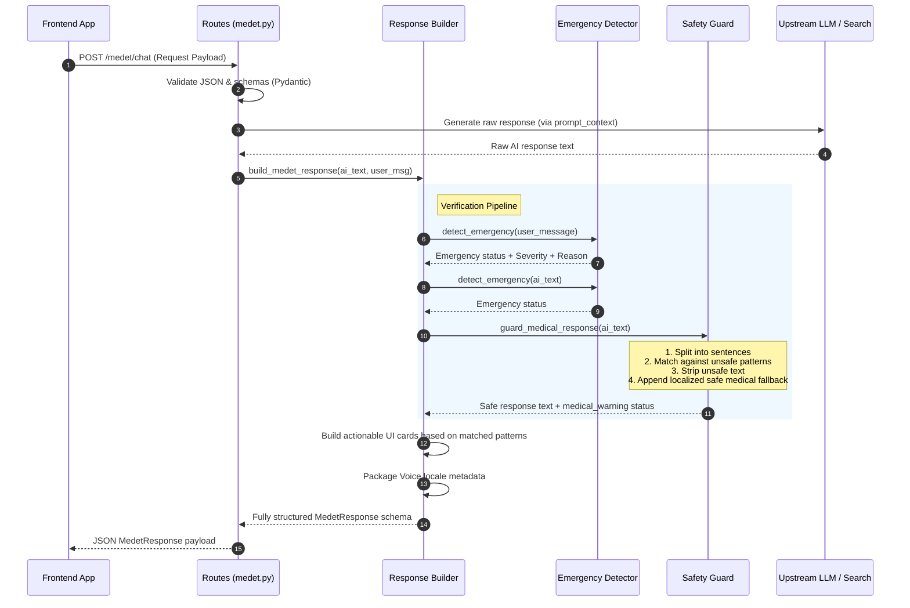

# Medet Backend Architecture & Codebase Analysis

[Medet](file:///Users/nikhilchhetri/medtech/medTech/medet-codex-medet-frontend-intelligence/README.md) is a specialized, compassionate AI-powered rural healthcare assistant designed for underserved and rural communities. Unlike general chatbots, Medet prioritizes clinical safety, accessibility, local language support, and deterministic emergency detection.

The backend is built as a lightweight **FastAPI** service that serves as a safety filter, context orchestrator, and structured metadata provider for the user-facing client.

---

## 1. Directory Structure

```
backend/
├── __init__.py
└── app/
    ├── __init__.py
    ├── main.py                    # Entrypoint & Exception handlers
    ├── core/
    │   ├── __init__.py
    │   └── errors.py              # Custom error declarations
    ├── routes/
    │   ├── __init__.py
    │   └── medet.py               # Chat and Streaming API controllers
    ├── schemas/
    │   ├── __init__.py
    │   └── medet_response.py      # Input/Output Pydantic structures
    └── services/
        ├── __init__.py
        ├── emergency_detector.py  # Regex & keyword-based symptom detector
        ├── healthcare_cards.py    # Actions/warning card builder
        ├── language_support.py    # Localized strings, prompts, translations
        ├── medet_response_builder.py # Main orchestration service
        ├── medical_safety_guard.py# Output clinical safety filter
        └── voice_support.py       # Speech/audio metadata builder
```

---

## 2. Component Breakdown

### 🔌 App Entrypoint & Global Exception Handling
* **File:** [main.py](file:///Users/nikhilchhetri/medtech/medTech/medet-codex-medet-backend-intelligence/backend/app/main.py)
* **Description:** Initializes the FastAPI app, registers the `/medet` router, and provides safety-net exception handlers. 
* **Key Mechanisms:**
  * Maps standard FastAPI `RequestValidationError` errors (422) into user-friendly JSON payloads conforming to `MedetErrorResponse`.
  * Catches empty queries, malformed JSON, and invalid languages, returning safe, parseable errors instead of standard raw tracebacks.
  * Catches `MedetAPIError` (e.g., LLM/Tavily upstream timeouts or failure states) and reports retry availability.

### 🌐 Routing & Endpoints
* **File:** [medet.py](file:///Users/nikhilchhetri/medtech/medTech/medet-codex-medet-backend-intelligence/backend/app/routes/medet.py)
* **Description:** Exposes routes for chat interaction.
* **Key Endpoints:**
  1. `POST /medet/chat`: Receives `MedetChatRequest` and returns a non-streaming structured `MedetResponse`.
  2. `POST /medet/chat/stream`: Server-Sent Events (SSE) streaming API. Emits raw tokens with `event: token` as they stream from the LLM, followed by a final `event: metadata` event containing the structured `MedetResponse` metadata payload (including emergency flags, safety warnings, and actionable cards) and `event: error` if anything goes wrong.
* **Orchestration Points:** Contains adapter stubs `_generate_ai_response` and `_stream_ai_response` where the primary LLM client (e.g., Ollama or custom model) and search client (e.g., Tavily) are integrated.

### 📋 Data Validation & Schemas
* **File:** [medet_response.py](file:///Users/nikhilchhetri/medtech/medTech/medet-codex-medet-backend-intelligence/backend/app/schemas/medet_response.py)
* **Description:** Defines rigorous Pydantic schemas validating all inputs/outputs.
* **Key Structs:**
  * `MedetChatRequest`: Validates user message length (1-4000), checks input type (`text` or `voice`), and verifies if the requested language is supported (`en`, `hi`, `bn`, `ne`, `ta`, `kn`).
  * `MedetResponse`: The structured contract returning:
    * `response`: The clean, safe output text.
    * `emergency`: Boolean representing whether urgent intervention is needed.
    * `severity`: Clinical severity evaluation (`low`, `medium`, `high`).
    * `medical_warning`: Boolean indicating if clinical safety rules filtered the response.
    * `trust_level`: Security indicator (`safe` or `guarded`).
    * `cards`: Actionable recommendations (e.g., Medication safety, Hydration steps).
    * `voice`: Voice session metadata (`voice_locale`, text-to-speech helper).

### 🚨 Emergency & Symptom Detection (Deterministic Rule-Engine)
* **File:** [emergency_detector.py](file:///Users/nikhilchhetri/medtech/medTech/medet-codex-medet-backend-intelligence/backend/app/services/emergency_detector.py)
* **Description:** Rather than relying on fuzzy machine learning classifiers to assess urgent medical risks, Medet utilizes a deterministic, keyword and regex-based rule engine.
* **Safety Rules:** Checks for 8 key high-risk categories in English and transliterated/native South Asian languages:
  1. Chest pain or heart attack signs.
  2. Breathing difficulties.
  3. Severe/heavy bleeding.
  4. Unconsciousness or fainting.
  5. Seizures and convulsions.
  6. Stroke symptoms (drooping face, weakness, slurred speech).
  7. Pregnancy-related bleeding.
  8. Severe/deep burns.
* **Negation Filtering:** Avoids false positives by parsing negations (e.g., "no chest pain", "bleeding has stopped") using negative lookbehind-like text matching.

### 🛡️ Clinical Safety Guard (Post-Processing Layer)
* **File:** [medical_safety_guard.py](file:///Users/nikhilchhetri/medtech/medTech/medet-codex-medet-backend-intelligence/backend/app/services/medical_safety_guard.py)
* **Description:** Intercepts LLM outputs to prevent clinical misinformation or dangerous advice.
* **Operations:**
  * Splits the response text into individual sentences.
  * Evaluates each sentence against 5 safety categories:
    1. *Guaranteed Diagnosis*: Strips sentences claiming absolute certainty (e.g., "You definitely have diabetes").
    2. *Unsafe Medication Certainty*: Prevents specific dosage recommendations or advice to alter clinical prescriptions (e.g., "Take 500mg paracetamol").
    3. *Dangerous Self-Treatment*: Blocks recommendations to treat dangerous symptoms entirely at home or avoid doctors.
    4. *Emergency Minimization*: Flags statements underplaying high-risk symptoms.
    5. *Fake Confidence*: Blocks promises of 100% cures or lack of side effects.
  * If a trigger is found, it discards the unsafe sentence, labels the request `guarded` (warning flag), and appends a safe local-language fallback redirecting the user to professional care.

### 🗣️ Multilingual & Localization Service
* **File:** [language_support.py](file:///Users/nikhilchhetri/medtech/medTech/medet-codex-medet-backend-intelligence/backend/app/services/language_support.py)
* **Description:** Houses native translations, localization scripts, and custom system instructions.
* **Supported Languages:**
  * English (`en`) — `en-IN` Speech locale
  * Hindi (`hi`) — `hi-IN` Speech locale
  * Bengali (`bn`) — `bn-IN` Speech locale
  * Nepali (`ne`) — `ne-NP` Speech locale
  * Tamil (`ta`) — `ta-IN` Speech locale
  * Kannada (`kn`) — `kn-IN` Speech locale
* **Core Functions:**
  * `build_multilingual_prompt_context`: Prepares detailed system instructions for LLMs, forcing it to maintain safe boundaries (never diagnose, adopt simple rural-friendly language, prompt for details, handle transcribed voice inputs gracefully).
  * Custom translations for emergency escalations, follow-up queries, and professional doctor referrals.

### 🃏 Dynamic Healthcare Cards
* **File:** [healthcare_cards.py](file:///Users/nikhilchhetri/medtech/medTech/medet-codex-medet-backend-intelligence/backend/app/services/healthcare_cards.py)
* **Description:** Automatically generates structured, language-synchronized actionable cards to be displayed in the frontend client.
* **Triggers:**
  * Emergency context triggers `emergency`, `action`, `doctor_visit`, and `symptom_warning` cards immediately.
  * Regular context parses user and response text:
    * If hydration is mentioned (vomiting, fever, heat) -> issues a **Fluids** card.
    * If medicines are mentioned -> issues a **Medicine Safety** card.
    * If high severity or worsening signs -> issues a **Watch Warning Signs** or **Talk to a Health Worker** card.
    * If weakness is mentioned -> issues a **Food and Strength** card.

---

## 3. Request & Safety Verification Pipeline

The following sequence illustrates how the backend orchestrates calls when a chat request is processed by [medet_response_builder.py](file:///Users/nikhilchhetri/medtech/medTech/medet-codex-medet-backend-intelligence/backend/app/services/medet_response_builder.py):



---

## 4. Key Strengths of the Implementation

1. **Defense-in-Depth Safety:** Security does not rely solely on the LLM's system instructions. If the LLM goes off-rails or hallucinations bypass the prompt context, the deterministic `medical_safety_guard` and `emergency_detector` intercept and sanitize the content on a sentence-by-sentence level before it is delivered to the client.
2. **First-Class Multilingualism:** The system is explicitly configured to handle South Asian local languages (including transliterated "Hinglish/Benglish" formats in voice transcription support), ensuring accessibility for rural populations.
3. **Structured Frontend Contracts:** Instead of dumping raw markdown or HTML blocks, the backend delivers highly structured data structures (`emergency`, `severity`, `cards`), allowing the Next.js client to render beautiful, accessible, and high-impact UI elements.
4. **SSE-Friendly Architecture:** The streaming implementation maintains rapid token responses for low-bandwidth environments while ensuring metadata events are delivered securely at the end of the stream.
